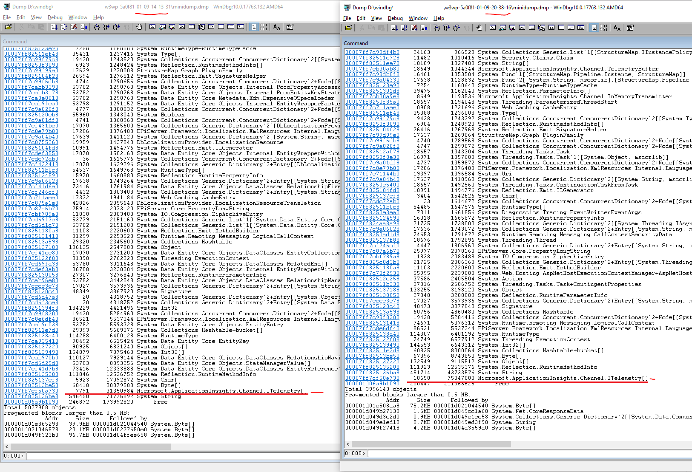

Tracking down performance issues can be tricky as they can be caused by many things. I noticed performance issues on some of our sites. Every day the site seemed to slow down for quite a while. Only some requests seemed to be affected, but it was quite clear that there was something wrong. Looking at performance data for a full week it looked like these issues occurred almost at random. It wasn't caused by any (heavy) nightly import job as the issues also popped up during the day. However it's easy to spot this pattern by just looking at the right chart, in this case the availability chart which also tracks request performance.

<p class="centered-image">
	
</p>

`Diagnose and solve problems` led me to the memory health chart, which uncovered the likely root of our issues. 

<p class="centered-image">
	
</p>

The memory usage drop in the morning of 01/06 wasn't caused by GC, it was caused by a recycle. The reason for the recycle can be found in the `LogFiles/eventlog.xml` file which can be found using [Kudu SCM](https://blogs.msdn.microsoft.com/benjaminperkins/2017/11/08/how-to-access-kudu-scm-for-an-azure-app-service-environment-ase/)

```
<Events>
    ...
    <Event>
        <System>
            <Provider Name="W3SVC-WP"/>
            <EventID>2299</EventID>
            <Level>1</Level>
            <Task>0</Task>
            <Keywords>Keywords</Keywords>
            <TimeCreated SystemTime="2019-01-06T05:10:48Z"/>
            <EventRecordID>x</EventRecordID>
            <Channel>Application</Channel>
            <Computer></Computer>
            <Security/>
        </System>
        <EventData>
            <Data>Worker Process requested recycle due to 'Percent Memory' limit. Memory Used: 3453165568 out of 3757625344 available. Exceeded 90 Percent of Memory 
</Data>
        </EventData>
    </Event>
    ...
</Events>
```

### Comparing memory dumps

<p class="centered-image">
	
</p>

As there's something building up over time I thought it made sense to compare the results of two memory dumps, taken at different points in time. I took one in the afternoon and one in the evening. Taking a memory a memory dump on Azure is very easy: 

* Go to KUDU SCM and open the process explorer (for example https://\<my-example-site>.scm.azurewebsites.net/ProcessExplorer/)
* Look for the w3wp.exe process **without** the `scm` label and copy the `pid`
* Browse to https://\<my-example-site>.scm.azurewebsites.net/api/processes/<insert-pid-here>/dump?dumpType=2&format=zip
  * This will generate a `full memory minidump of process with id. This will include matching sos.dll and mscordackws.dll in the zip package.`
  * **NOTE:** This will make your site unresponsive for a couple of minutes
* Wait for the download and unzip to a folder

*I tried some other options for taking a memory dump as well, however I ended up with a corrupted dump twice. It's so easy to take a memory dump with the procedure I just described that I won't bother doing anything else in the future.*

Now we'll start to analyze the memory dumps, as I said I decided to compare both .dmp files.

* Open [windbg](https://docs.microsoft.com/en-us/windows-hardware/drivers/debugger/debugger-download-tools), open the `.dmp` file
* Wait for it to load, run the following commands to inspect memory location in the heap. This might take a couple of minutes

```
.load D:\windbg\geta-commerce-prod\w3wp-5a0f81-01-09-20-38-16\sos.dll
!dumpheap -stat
```

<p class="centered-image">
	
</p>

To be honest, I was not completely sure what I was looking for. However one thing caught my attention straight away.., for some reason we have loads of ITelemetry objects in memory, almost 7.8k in the afternoon and 18.65k in the evening. This does not make sense as these should be flushed quite regularly, indication some misconfiguration of Application Insights. I decided to remove some of the custom tracking to see what happened.

<p class="centered-image">
	
</p>

After the release you see the memory drop and, as I hoped, we don't see that nasty slope on our memory usage chart anymore. It turns out our memory issues were quite obvious and it was not that hard to track down what was wrong.

I hope this post is of any help, for me it was great to find out how easy it is to take a memory dump on Azure. The problem I had was easy to track down and hopefully our memory issues have been solved.

https://plumbr.io/blog/memory-leaks/memory-leaks-fallacies-and-misconceptions